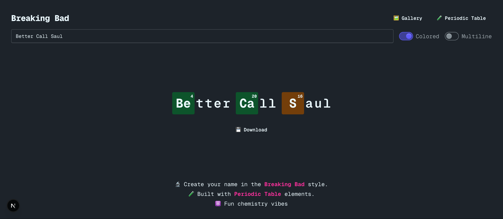
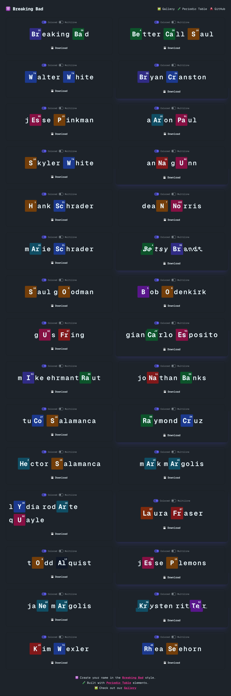
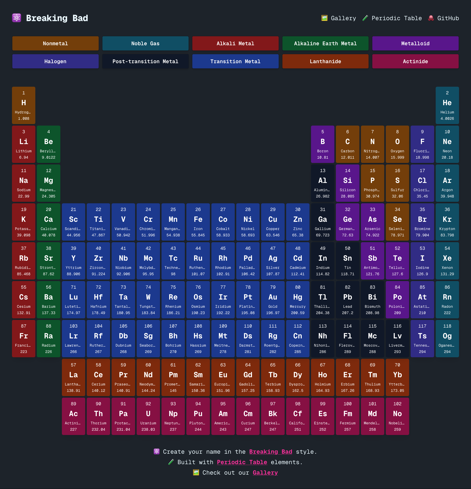

# 🧪 Breaking Bad

Create names in the iconic **Breaking Bad** style using **Periodic Table elements**.

Generate, preview, and download chemistry-inspired logos inspired by *Breaking Bad* and *Better Call Saul*.

👉 **Live demo:** [Breaking Bad](https://hieudoanm.github.io/breaking-bad)

---

## ✨ Features

- 🧪 Breaking Bad–style text rendering
- 🔬 Smart chemical element highlighting (one element per word)
- 🎨 Colored or monochrome styles
- 📐 Text alignment: left, center, or right
- ↕️ Single-line or multiline layouts
- 💾 Export previews as PNG images
- 🖼️ Character gallery from *Breaking Bad* & *Better Call Saul*

---

## ✏️ Editor

Create your own Breaking Bad–style logo.

- Enter any name or phrase
- Automatically highlights a periodic-table element
- Toggle color and layout options
- Adjust alignment
- Download the result as an image

---

## 🖼️ Gallery

A curated gallery of iconic *Breaking Bad* and *Better Call Saul* characters,
showing how their names render using periodic table elements.

| No. | Character            | Actor / Actress    |
| --- | -------------------- | ------------------ |
| 0   | Breaking Bad         | Better Call Saul   |
| 1   | Walter White         | Bryan Cranston     |
| 2   | Jesse Pinkman        | Aaron Paul         |
| 3   | Skyler White         | Anna Gunn          |
| 4   | Hank Schrader        | Dean Norris        |
| 5   | Marie Schrader       | Betsy Brandt       |
| 6   | Saul Goodman         | Bob Odenkirk       |
| 7   | Gus Fring            | Giancarlo Esposito |
| 8   | Mike Ehrmantraut     | Jonathan Banks     |
| 9   | Tuco Salamanca       | Raymond Cruz       |
| 10  | Hector Salamanca     | Mark Margolis      |
| 11  | Lydia Rodarte Quayle | Laura Fraser       |
| 12  | Todd Alquist         | Jesse Plemons      |
| 13  | Jane Margolis        | Krysten Ritter     |
| 14  | Kim Wexler           | Rhea Seehorn       |

---

## 🧬 Periodic Table

The app is powered by a complete periodic table dataset, used to detect and
highlight chemical symbols inside words.

---

## 🛠️ Tech Stack

- ⚛️ **Next.js**
- 🟦 **TypeScript**
- 🎨 **Tailwind CSS** + **daisyUI**
- 🧠 Custom element-matching algorithm
- 📸 **html2canvas** for image export

---

## ⚠️ Disclaimer

This project is a fan-made tribute.  
*Breaking Bad* and *Better Call Saul* are trademarks of **AMC Networks**.  
No affiliation or endorsement is implied.
